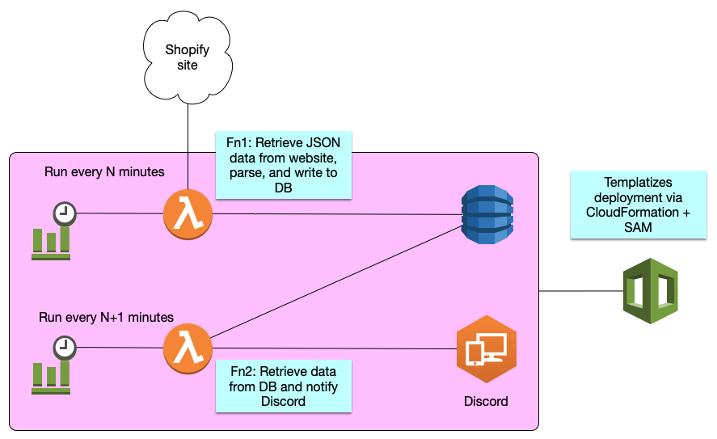
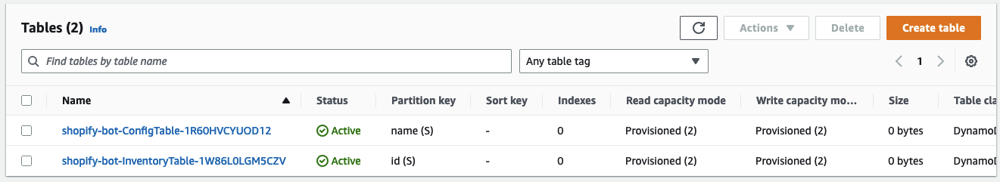
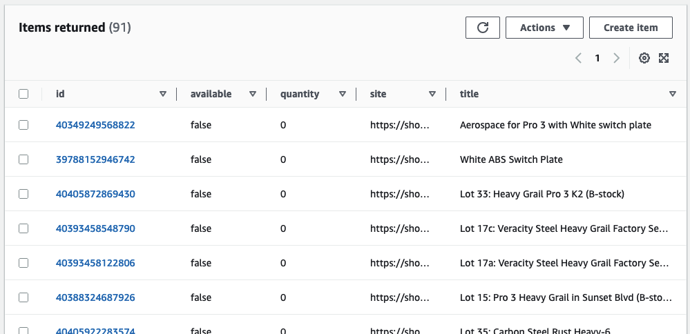

# Shopify Bot

This project contains source code and supporting files for a serverless Shopify monitoring application that you can deploy with the AWS Serverless Application Model (AWS SAM) command line interface (CLI). 



It includes the following files and folders:

- `src` - Code for the application's Lambda function.
- `events` - Invocation events that you can use to invoke the function.
- `__tests__` - Unit tests for the application code. 
- `template.yaml` - A template that defines the application's AWS resources.

The application uses several AWS resources, including Lambda functions, an API Gateway API, and Amazon DynamoDB tables. These resources are defined in the `template.yaml` file in this project. You can update the template to add AWS resources through the same deployment process that updates your application code.

## Cheat Sheet

```bash
# test locally
sudo sam local invoke "ShopifySyncFunction" -e events/event-get-all-items.json
sudo sam local invoke "ShopifySnsPublisherFunction" -e events/event-sns-back-in-stock.json
sudo sam local invoke "ShopifySnsPublisherFunction" -e events/event-sns-sold-out.json
sudo sam local invoke "ShopifySnsPublisherFunction" -e events/event-sns-quantity-changed.json
sudo sam local invoke "DiscordSnsSubscriberFunction" -e events/event-post-item.json # NOT WORKING YET

# build & deploy
sam build
sam deploy

# update the Discord API key
aws secretsmanager put-secret-value \
    --secret-id DiscordApiKey \
    --secret-string file://secrets.json
    
# add shopify sites to monitor
curl -X POST https://avu7ocpb49.execute-api.us-east-1.amazonaws.com/Prod/config\?site\=https://shop.someShopifySite.com/products/product1.js\&site\=https://shop.someShopifySite.com/products/product2.js\&site\=https://shop.someShopifySite.com/products/product3.js.js
```

---

## Getting Started

### Initial Deployment

To use the AWS SAM CLI, you need the following tools:

* AWS SAM CLI - [Install the AWS SAM CLI](https://docs.aws.amazon.com/serverless-application-model/latest/developerguide/serverless-sam-cli-install.html).
* Node.js - [Install Node.js 18](https://nodejs.org/en/), including the npm package management tool.
* Docker - [Install Docker community edition](https://hub.docker.com/search/?type=edition&offering=community).

To build and deploy your application for the first time, run the following in your shell:

```bash
sam build

# alternatively:
sam deploy --guided
```

The first command will build the source of your application. The second command will package and deploy your application to AWS, with a series of prompts:

* **Stack Name**: The name of the stack to deploy to CloudFormation. This should be unique to your account and region, and a good starting point would be something matching your project name.
* **AWS Region**: The AWS region you want to deploy your app to.
* **Confirm changes before deploy**: If set to yes, any change sets will be shown to you before execution for manual review. If set to no, the AWS SAM CLI will automatically deploy application changes.
* **Allow SAM CLI IAM role creation**: Many AWS SAM templates, including this example, create AWS IAM roles required for the AWS Lambda function(s) included to access AWS services. By default, these are scoped down to minimum required permissions. To deploy an AWS CloudFormation stack which creates or modifies IAM roles, the `CAPABILITY_IAM` value for `capabilities` must be provided. If permission isn't provided through this prompt, to deploy this example you must explicitly pass `--capabilities CAPABILITY_IAM` to the `sam deploy` command.
* **Save arguments to samconfig.toml**: If set to yes, your choices will be saved to a configuration file inside the project, so that in the future you can just re-run `sam deploy` without parameters to deploy changes to your application.

The API Gateway endpoint API will be displayed in the outputs when the deployment is complete.

### Set the Discord API Key

The initial Sam/CloudFormation stack deployment will automatically create a secret in AWS Secrets Manager in which the 
Discord API will be stored. The value is set to an arbitrary placeholder, so make sure you change it before you start 
using the app.  

You can either login to the AWS Console to update the secret, _or_, if you have the AWS SDK installed, you can store the API key in the provided `secrets.template.json` file and push it as follows:

```bash
# copy the template to a file called secrets.json
cp secrets.template.json secrets.json

# edit the file using your preferred text editor

# use the SDK to push the new value
aws secretsmanager put-secret-value \
    --secret-id DiscordApiKey \
    --secret-string file://secrets.json
```

### Add Shopify websites

Now you are ready to start monitoring some Shopify websites!

The Shopify monitor determines which Shopify URLs to monitor based on `SITE` objects in the DynamoDB `ConfigTable`. On
each synchronization event, the `ShopifySyncFunction` will extract all available URLs from this table and scrape them 
for inventory data.

Sites can be added via `POST /config?site=`. You can include multiple `site` query parameters in the same request.

Here is an example using `curl`:

```bash
curl -X POST https://your-slug.execute-api.us-east-1.amazonaws.com/Prod/config\
  ?site=https://shopifySite1.com \
  &site=https://shopifySite2.com \
```

If you wish edit the DynamoDB `ConfigTable` using alternative means, note that Shopify site items use the following data 
model. The `type: "SITE"` property is required.

```json
{
  "name": "https://the-name-of-your-shopify-website",
  "type": "SITE"
}
```

## Visuals

After the app has been deployed, here are some screenshots to give you an idea of what is deployed:

Two DynamoDB tables are initialized:
- `ConfigTable` for storing Shopify site URLs (and possibly other things in the future)
- `InventoryTable` for storing items scraped from Shopify targets




Four Lambda functions are deployed:


