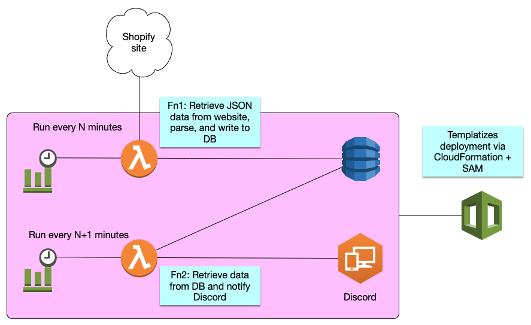

# Shopify Bot

This project contains source code and supporting files for a serverless Shopify monitoring application that you can deploy with the AWS Serverless Application Model (AWS SAM) command line interface (CLI). 



It includes the following files and folders:

- `src` - Code for the application's Lambda function.
- `events` - Invocation events that you can use to invoke the function.
- `__tests__` - Unit tests for the application code. 
- `template.yaml` - A template that defines the application's AWS resources.

The application uses several AWS resources, including Lambda functions, an API Gateway API, and Amazon DynamoDB tables. These resources are defined in the `template.yaml` file in this project. You can update the template to add AWS resources through the same deployment process that updates your application code.

## Cheat Sheet

```bash
# locally test 
sudo sam local invoke "ShopifySynchronizationFunction" -e events/event-get-all-items.json
sudo sam local invoke "postToDiscordFunction" -e events/event-post-item.json

# deploy
sam deploy
```

## Getting Started

To use the AWS SAM CLI, you need the following tools:

* AWS SAM CLI - [Install the AWS SAM CLI](https://docs.aws.amazon.com/serverless-application-model/latest/developerguide/serverless-sam-cli-install.html).
* Node.js - [Install Node.js 18](https://nodejs.org/en/), including the npm package management tool.
* Docker - [Install Docker community edition](https://hub.docker.com/search/?type=edition&offering=community).

To build and deploy your application for the first time, run the following in your shell:

```bash
sam build
sam deploy --guided
```

The first command will build the source of your application. The second command will package and deploy your application to AWS, with a series of prompts:

* **Stack Name**: The name of the stack to deploy to CloudFormation. This should be unique to your account and region, and a good starting point would be something matching your project name.
* **AWS Region**: The AWS region you want to deploy your app to.
* **Confirm changes before deploy**: If set to yes, any change sets will be shown to you before execution for manual review. If set to no, the AWS SAM CLI will automatically deploy application changes.
* **Allow SAM CLI IAM role creation**: Many AWS SAM templates, including this example, create AWS IAM roles required for the AWS Lambda function(s) included to access AWS services. By default, these are scoped down to minimum required permissions. To deploy an AWS CloudFormation stack which creates or modifies IAM roles, the `CAPABILITY_IAM` value for `capabilities` must be provided. If permission isn't provided through this prompt, to deploy this example you must explicitly pass `--capabilities CAPABILITY_IAM` to the `sam deploy` command.
* **Save arguments to samconfig.toml**: If set to yes, your choices will be saved to a configuration file inside the project, so that in the future you can just re-run `sam deploy` without parameters to deploy changes to your application.

The API Gateway endpoint API will be displayed in the outputs when the deployment is complete.

## Use the AWS SAM CLI to build and test locally

Build your application by using the `sam build` command.

```bash
my-application$ sam build
```

The AWS SAM CLI installs dependencies that are defined in `package.json`, creates a deployment package, and saves it in the `.aws-sam/build` folder.

Test a single function by invoking it directly with a test event. An event is a JSON document that represents the input that the function receives from the event source. Test events are included in the `events` folder in this project.

Run functions locally and invoke them with the `sam local invoke` command.

```bash
sudo sam local invoke "ShopifySynchronizationFunction" -e events/event-get-all-items.json
sudo sam local invoke "postToDiscordFunction" -e events/event-post-item.json
```

The AWS SAM CLI can also emulate your application's API. Use the `sam local start-api` command to run the API locally on port 3000.

```bash
my-application$ sam local start-api
my-application$ curl http://localhost:3000/
```

The AWS SAM CLI reads the application template to determine the API's routes and the functions that they invoke. The `Events` property on each function's definition includes the route and method for each path.

```yaml
      Events:
        Api:
          Type: Api
          Properties:
            Path: /
            Method: GET
```

## Fetch, tail, and filter Lambda function logs

To simplify troubleshooting, the AWS SAM CLI has a command called `sam logs`. `sam logs` lets you fetch logs that are generated by your Lambda function from the command line. In addition to printing the logs on the terminal, this command has several nifty features to help you quickly find the bug.

**NOTE:** This command works for all Lambda functions, not just the ones you deploy using AWS SAM.

```bash
my-application$ sam logs -n putItemFunction --stack-name sam-app --tail
```

**NOTE:** This uses the logical name of the function within the stack. This is the correct name to use when searching logs inside an AWS Lambda function within a CloudFormation stack, even if the deployed function name varies due to CloudFormation's unique resource name generation.

You can find more information and examples about filtering Lambda function logs in the [AWS SAM CLI documentation](https://docs.aws.amazon.com/serverless-application-model/latest/developerguide/serverless-sam-cli-logging.html).

## Unit tests

Tests are defined in the `__tests__` folder in this project. Use `npm` to install the [Jest test framework](https://jestjs.io/) and run unit tests.

```bash
my-application$ npm install
my-application$ npm run test
```

## Cleanup

To delete the sample application that you created, use the AWS CLI. Assuming you used your project name for the stack name, you can run the following:

```bash
aws cloudformation delete-stack --stack-name keeb-bot
```