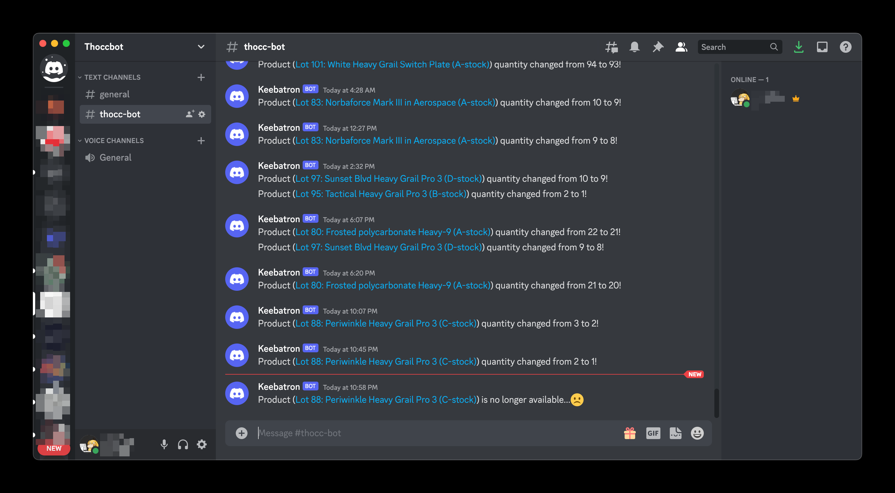
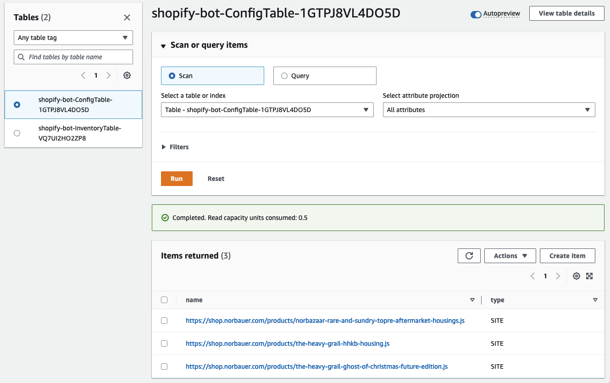

# Shopify Bot

A serverless Shopify Discord monitoring application that you can deploy with the AWS Serverless Application Model (AWS SAM) command line interface (CLI).

## Overview

It includes the following files and folders:

- `src` - Code for the application's Lambda function.
- `events` - Invocation events that you can use to invoke the function.
- `__tests__` - Unit tests for the application code.
- `template.yaml` - A template that defines the application's AWS resources.

The application uses several AWS resources, including Lambda functions, an API Gateway API, and Amazon DynamoDB tables. These resources are defined in the `template.prod.yaml` and `template.dev.yaml` files in this project. You can update the templates to add AWS resources through the same deployment process that updates your application code.

If you wish to contribute to this project, please refer to our [Developer Guide](DEVELOPMENT.md) for instructions on how to get started, build, test, and deploy this project.

## Getting Started

Whether you're interested in contributing to the project, or wish to deploy your own instance of the Shopify Bot, you'll find everything you need in the [DEVELOPMENT.md](./DEVELOPMENT.md) file.

The aforementioned developer guide contained detailed instructions covering the following topics:

- Setting up your development environment
- Building the project
- Running the unit tests (Coming Soon&trade;)
- Deploying your own stack
- Cleaning up your environment after you're done

## Visual Tour

After the app has been deployed, here are some screenshots to give you an idea of what is deployed:

Two DynamoDB tables are initialized:
- `ConfigTable` for storing Shopify site URLs (and possibly other things in the future)
- `InventoryTable` for storing items scraped from Shopify targets

Four Lambda functions are deployed:

One SQS instance is initialized. This is where all Discord messages are queued up:

One secret will be initialized for the Discord API key:

One EventBridge rule will be created to schedule the `ShopifySyncFunction` to check all of the Shopify targets every 5
minutes:

And lastly, an API Gateway instance containing one `GET` endpoint and two `POST` endpoints will be initialized.

- `GET {api-root}` : triggers `ShopifySyncFunction` (helpful if you don't want to wait the 5 minutes for the bot the check the Shopify targets)
- `POST {api-root}` : FUTURE RELEASE -- will trigger a general status update to post on Discord
- `POST {api-root}/config?site=` : adds Shopify targets to the `ConfigTable`

